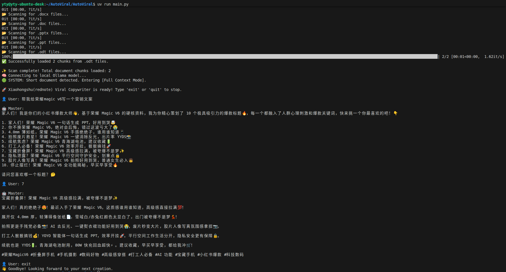
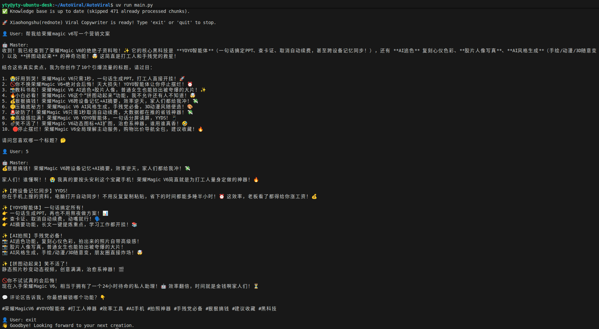

# AutoViral Marketing Agent 🚀

An intelligent, fully local AI agent designed to generate high-converting marketing copy (e.g., Xiaohongshu/RED note) based on your local product documents. It utilizes a local LLM via Ollama and dynamic context routing to ensure data privacy, zero API costs, and maximum output quality.

## 🌟 Key Features: Dynamic Context Routing

To achieve the best possible copywriting results without sacrificing system stability, this program dynamically chooses how to process your product documents based on their total text length.

### 🟢 Context Stuffing Mode (Short Texts)
If the total extracted text from your documents is under a certain threshold (e.g., 11,451 characters), the program directly injects the entire text into the LLM's system prompt. This gives the AI a perfect, global understanding of the product for more coherent and profound copywriting.

> **Demo: Full Context Mode**
> 
> *The system detects a short document, enters Full Context Mode, and successfully generates a Xiaohongshu post with interactive multi-turn title selection.*
> 
> 

### 🔴 RAG Agent Mode (Long Texts)
If the document is too long (e.g., massive product manuals or industry reports), the system automatically switches to a Retrieval-Augmented Generation (RAG) workflow. It chunks the text, updates a local Chroma vector database, and equips the Agent with a search tool (`search_product_knowledge`) to retrieve relevant information on demand.

> **Demo: RAG Agent Mode**
> 
> *The system detects long documents, syncs the Chroma database, and acts as an Agent to retrieve specific data before writing the copy.*
> 
> 

## 📂 Project Structure

```text
my_marketing_agent/
├── data/           # Drop your product documents here (PDF, DOCX, PPTX, etc.).
├── db/             # Automatically generated local Chroma vector database.
├── prompts/        # Contains prompt templates (e.g., Xiaohongshu master prompts).
├── skills/         # Agent Tools: Functions decorated with @tool for the LLM to use (e.g., RAG search).
├── utils/          # System Utilities: Background scripts for reading files and syncing the vector DB.
├── main.py         # The core entry point, routing logic, and interactive chat loop.
└── pyproject.toml  # Package dependencies managed by uv.
```

## 🛠️ Usage Instructions

### 1. Prerequisites
* Install and run **Ollama** locally.
* Pull your preferred local model (e.g., Qwen). The default is set to `qwen3.5:27b` (or update `main.py` with your specific model).
    ```bash
    ollama run qwen3.5:27b
    ollama pull nomic-embed-text  # Required for the local embedding model
    ```
* Ensure you have the ultra-fast Python package manager **`uv`** installed.

### 2. Add Your Documents
Place your product materials (PDFs, Word documents, etc.) into the `data/` folder. The system will automatically read and process them upon startup.

### 3. Run the Agent
Start the interactive interactive agent using `uv`:

```bash
uv run main.py
```

The system will automatically analyze the document length, choose the best processing mode, and enter an interactive chat interface where you can ask it to generate specific marketing copy.

## 🙏 Acknowledgements

The core prompt templates located in the `prompts/` directory are adapted from the excellent [LangGPT](https://github.com/yzfly/LangGPT) project. LangGPT provides a highly effective, structured framework for designing powerful LLM prompts.